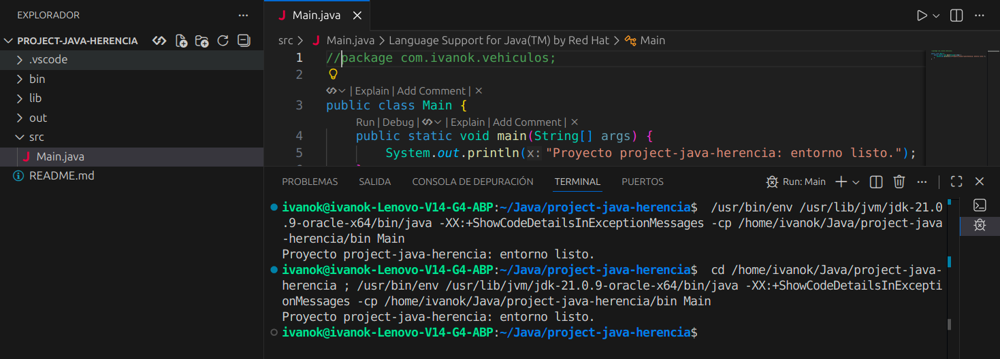
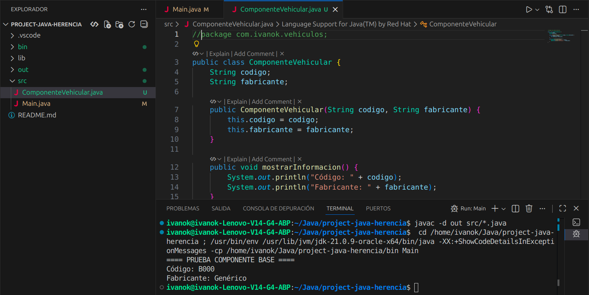
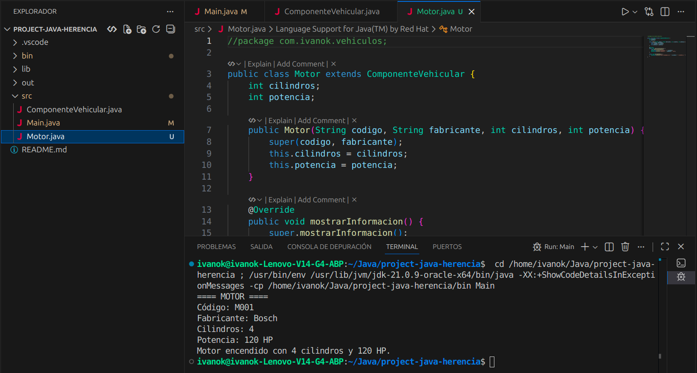
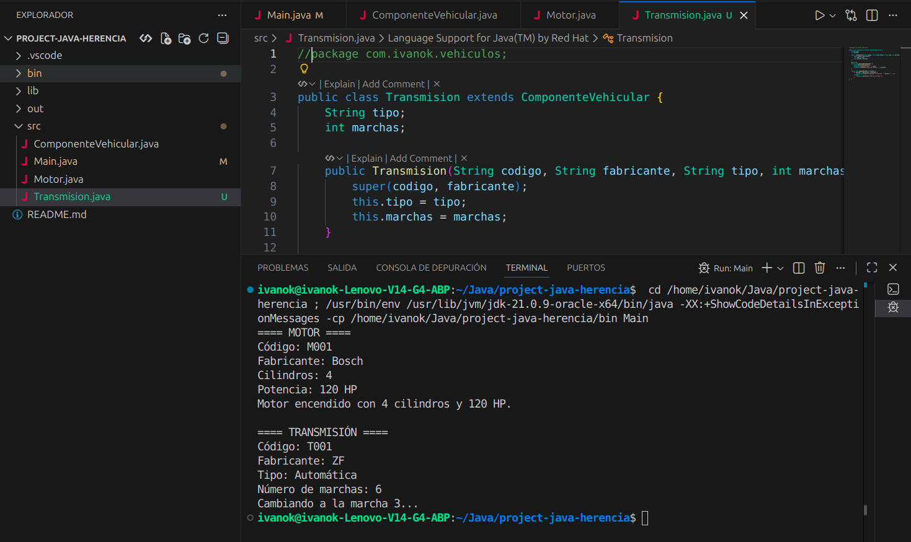
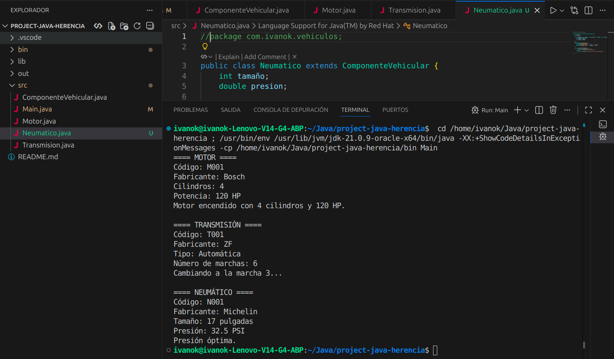
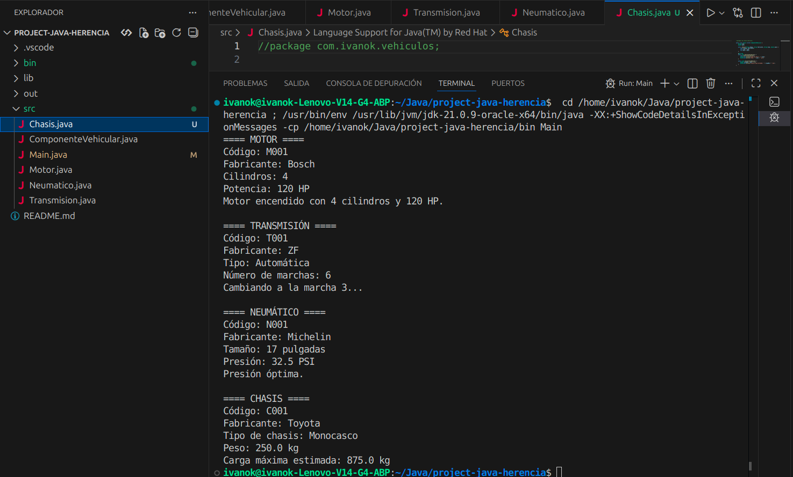
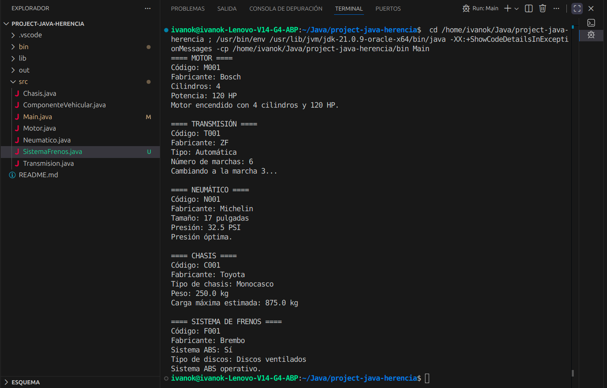
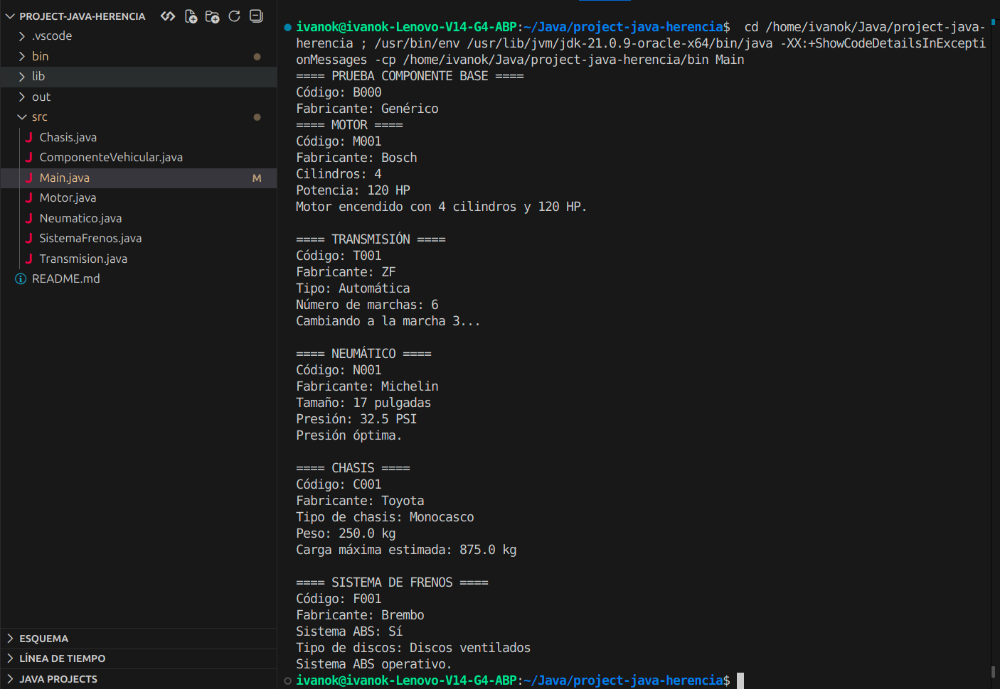

# project-java-herencia

Proyecto Java para demostrar **herencia** y **polimorfismo** con componentes vehiculares.

## Jerarquía de clases

- **ComponenteVehicular (base)**
  - Motor → `encenderMotor()`
  - Transmision → `cambiarMarcha(int)`
  - Neumatico → `verificarPresion()`
  - Chasis → `calcularCargaMaxima()`
  - SistemaFrenos → `verificarABS()`

## Capturas de ejecución

